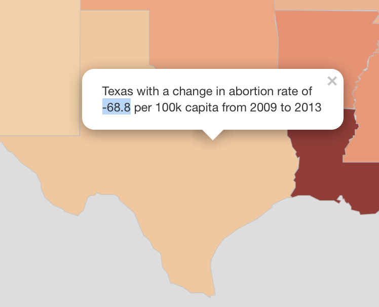
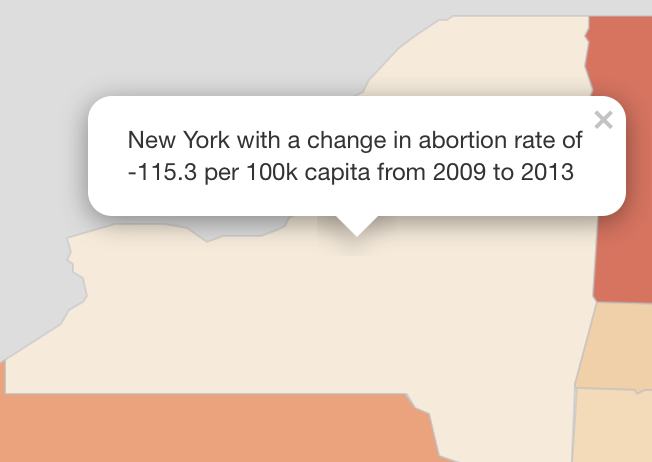
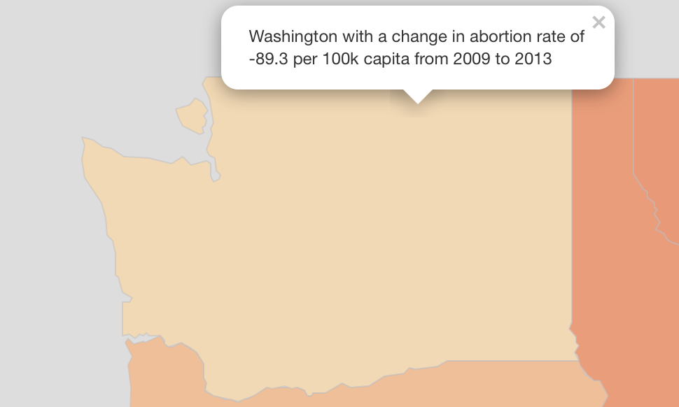
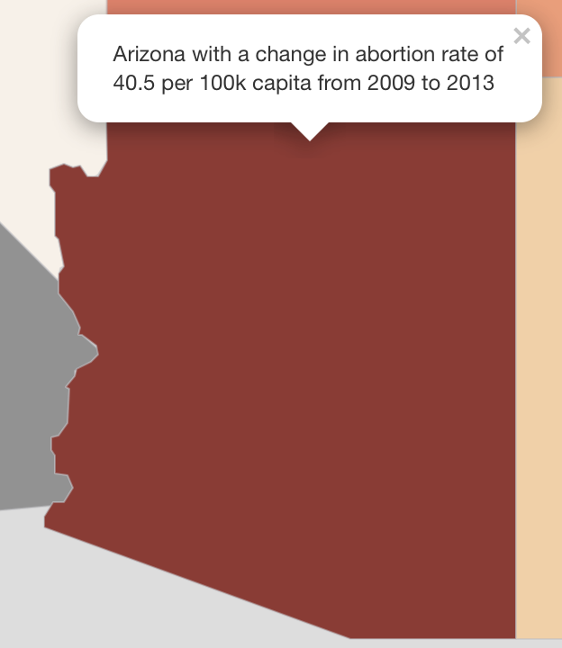
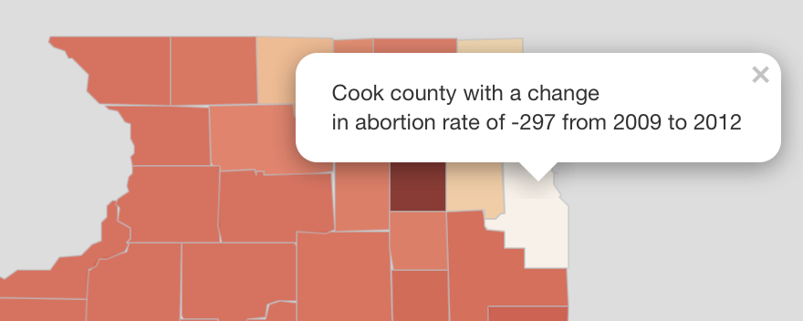

## Abortion Services and Policy

### How changes in access to abortion care has changed over the years relative to policy and funding
**_Nico Malig, Sabrina Niklaus, Spencer Pease, Ethan Tarr_**

#### Abstract

The bettering the health of our country is a goal of all policymakers, however restrictions confound the fostering of effective change. One of the most contentious policy areas is that of women’s health, specifically abortion services. In this study, we compiled data across four different sets in order to create a comprehensive foundation for our analysis. During our study, we recognized three distinct themes: Regional Impact, Contributing Factors, and Availability. This was performed across a cross-comparison using a four-state compilation representative of "National Level" data and the State of Illinois’s metrics. This was to test for granularity bias. 

The trends showed that states which have the *least restrictive, liberal* policies end up measuring some of lowest rates of abortions across time, where the converse (more restrictions leads to higher rates) is true as well. Notably, we saw no difference when testing for granularity bias.

#### Introduction

Policies affecting maternal health, women’s reproductive health, and abortion care are some of the most politically polarized policies in the United States. Ever since abortion was first legalized in the US in 1973, states across the nation have been creating laws limiting the circumstances under which a woman may obtain an abortion. These limitations largely have centered around insurance coverage, mandating the parental involvements of minors seeking abortion, and requiring certain procedures or counseling that may effectively deter women from undergoing her abortion procedure as a whole. Over the years, national policies relevant to a woman’s reproductive rights have been passed and retracted dependent on parties holding office. One may reference the Partial-Birth Abortion Ban act, which was vetoed by President Bill Clinton in 1995 and again in 1997, only to be signed by President George W. Bush in 2003. Similarly we can reference the Mexico City Policy, otherwise known as the Global Gag Rule. The policy was initially announced by the Reagan Administration in 1984, and was later rescinded in 1993 by President Bill Clinton. The rule was later re-imposed by President George W. Bush in 2001, only to be later rescinded by President Barack Obama in 2009. Most recently, President Donald Trump imposed his Global Gag Rule memorandum January 2017. In the current movements into the Trump administration, it is important to consider and recognize the implications of these policies on maternal health.

Over the years, funding of abortion provision has also fluctuated due to shifts in policy. Planned Parenthood is the largest single provider of reproductive health services, including abortion, in the United States. The Title X Family Planning Program, a federal grant program dedicated to providing individuals with comprehensive family planning and related preventive health services, grants approximately 25% of its funding to Planned Parenthood. Due to its controversial nature, Planned Parenthood is prohibited from using federal funds to perform abortions. However, abortion opponents argue that any Title X funding enables Planned Parenthood to utilize non-federal money to fund abortions.

For this reason, many House Republicans, including now Vice President Mike Pence, have been attempting to prevent federal funding of Planned Parenthood. Kansas, New Hampshire, and Tennessee legislature have blocked Title X family planning funds from flowing to abortion (Redden et al. 2015). Similarly, North Carolina barred family planning clinics not affiliated with the state from receiving family planning funds altogether. Ohio, Texas, and Michigan adopted a model allocating state and federal family planning funds through a tiered system that prioritizes recipients, thus placing family planning clinics last in line below state health clinics and community clinics. Notably, there was only **one** federal policy change on abortions in our scope of analysis (2009 - 2013).

* In 2009, President Barack Obama lifted the Mexico City Policy (global gag rule). The Mexico City Policy requires foreign NGOs "to certify that they will not “perform or actively promote abortion as a method of family planning" with non-U.S. funds as a condition for receiving U.S. global family planning assistance”

Due to variability and controversy of abortion restrictions and policy across states, accurate and consistent data on abortion prevalence is limited. The CDC’s Pregnancy Mortality Surveillance System includes data on pregnancy-related deaths, defined as "the death of a woman while pregnant or within 1 year of pregnancy termination - regardless of the duration or site of the pregnancy - from any cause related to or aggravated by the pregnancy or its management, but not from accidental or incidental causes" (Centers for Disease Control and Prevention, 2017). Since the implementation of the Pregnancy Mortality Surveillance System, the number of pregnancy-related deaths have increased from 7.2 per 100,000 live births in 1987 to 17.8 per 100,000 live births in 2009 and 2011.

This trend of rising maternal mortality, particularly in relation to pregnancy, is often discussed in relation to increased rates of heart problems and other chronic medical conditions. While those issues are important public health problems, it is important to consider what the implications of *policies* related to reproductive rights have on maternal health. With knowledge of this trend in conjunction with an analysis of abortion prevalence over the years, this paper serves as an inquiry into the relationship between policy and rates of abortion over time.

Given these trends, we utilize the U.S. Department of Health and Human Services’s data on maternal and child health. Focusing on the national outcome measures of severe maternal morbidity, maternal mortality, perinatal mortality and infant mortality to evaluate the potential effects policy and restrictions on abortion have on maternal and infant mortality, as well as analyze any potential similarities between trends in abortion rates and trends in mortality and morbidity.  

#### Related Work

The Center for Reproductive Rights created a report analyzing the relationship between a state’s number of abortion restrictions and a state’s number of evidence-based policies that support women’s and children’s well-being. They examined state-level policies and outcomes related to the well-being of women and children, addressing health, social, and economic status. Using this information, they determined whether there was any relationship, and to what degree it existed, between those policies and outcomes and state-level restrictions on abortion.

The analysis rendered results indicating that restricting restricting abortion is not beneficial to women. A consistently negative relationship between a state’s number of abortion restrictions and its performance on indicators of women's and children’s health, policies to support women and children, and social determinants of health. The study highlighted the negative effects of specific restrictions, including the increased risk associated with delaying abortion procedures, and the increased risk of a woman experiencing poverty physical health impairments and intimate partner violence due to abortion denial. The report ultimately emphasizes "the need for state policymakers to focus broadly on improving the wellbeing of women and children, rather than restricting access to needed health care services such as abortion" (Burns, 2014).

#### Methods

To analyze trends in abortion prevalence over time by cross-comparing changes in National and State policies, we utilized data from the Centers for Disease Control and Prevention (CDC) and data collected by the Illinois state government. The CDC’s abortion surveillance system provides prevalence data of abortions both by state of maternal residence, and by state of clinical service for the years 2009 through 2013. We utilize this data to analyze trends over time, relative to changes in policy as well as changes in planned parenthood funding.

Changing rates of abortion by state of residence can be misinterpreted, as they also are related to changing state population. For this reason, in our analysis we utilize annual state population estimate data from the U.S. Census Bureau’s Population Division, normalizing rates by calculating each state’s proportion of abortions relative to the total population. It is important to note that while this scales rates nationally, calculating proportions relative to state population rather than total pregnancies renders certain limitations in our analysis, namely that we’re no longer looking at prevalence of eligible birth givers (the population of the metric at focus). Similarly, to normalize the rates of abortion by state of service we calculated the state proportions relative to the total amount of abortions recorded that year. This way we can analyze trends in concentration of state of service over the years, as policies and funding shifts.

The Centers for Disease Control and Prevention’s abortion surveillance system is currently the sole governmental source of abortion data. The CDC collects abortion prevalence data for each state, dependent on each state’s data collection and management. The CDC maintains the federal role of issuing forms, guidelines, model legislation and compiling state information, however it does not share in the cost of state data collection. Furthermore, each state’s vital statistics agency submits data to the CDC on a voluntary basis, and as a result there is a lack in data from two non-reporting states: California, New Hampshire, Wyoming, and Maryland. Additionally, there is significant variance in data collection and management methods across states, as well as the level of detail in the collected reporting forms.

Due to discrepancies in data between states, we utilized the data provided by the Illinois state government to provide a more granular analysis of trends in abortion prevalence over time, and because Illinois data and the associated contextual information was highly accessible both in a statistic and an availability sense.

In addition to analyzing the rates of abortion over time relative to relevant policies, we utilized data on maternal and child health to reference the effects of policy on maternal health as well as inquire about potential correlation between abortion rates and maternal health outcomes. The U.S. Department of Health and Human Services collects National Outcome Measures which "cross all population domains and reflect maternal and child health population health status". The National Outcome Measures are determined based on various criterion, including the consideration of a measure being an important health condition for monitoring due to its increasing prevalence.

In conjunction with our prior analysis, we utilized data between 2009 and 2013 on the following outcomes: Severe Maternal Morbidity, Maternal Mortality, Infant Mortality, and Perinatal Mortality. Severe maternal morbidity is measured as the number of deliveries hospitalizations with an indication of severe morbidity (e.g. heart or kidney failure, stroke, embolism, hemorrhage). It is estimated that severe maternal morbidity has increased over 75% over the past decade, which has been attributed to rises in chronic conditions such as obesity, diabetes, hypertension, etc. However, it is also relevant to consider abortion availability may also contribute to rates of maternal morbidity, as unsafe abortions contribute to additional risk of morbidity, and mortality. For this reason we look at this outcome, as well as the outcome of maternal mortality which econmpasses the number of deaths related to or aggravated by pregnancy and occurring within 42 days of the end of a pregnancy.

Furthermore, we look at perinatal mortality, which refers to the number of fetal deaths 28 weeks or more gestation plus early neonatal deaths occurring under 7 days. This may include stillbirths and deaths in the first week of life, which serves as a reflection both of the pregnancy environment and early newborn care. We also look at the outcome of infant mortality, in direct comparison to infant mortality. Not only do we look at all of these outcomes on individual levels, but we look at the general trends alongside one another. It is important to note that due to inconsistencies by state data collection methods, data is unavailable from a number of states, however the the data can be utilized as representative of the national population trends.

#### Results

The best way to analyze how policy affects abortion, considering that there were no federally-enacted changes to domestic abortion legality or funding, is to comb *state-by-state* to see possible connections between the two evaluations. This is an intensely complex analysis and for the scope and timeline of this project, we’ve decided to analyze four states: controlling for partisanship and location. The states we’ve chosen for analysis are **Texas**, **New York**, **Washington State**, and **Arizona**. These states attempt to represent the national level population because, again, *no policy changes *have been enacted at the federal level in many, many years so we cannot create an analysis of how policy changes abortion rates.

Let’s start with with one of the more prominent states in this comparison.

**National Level Analysis: Four States of Interest**

**Texas**

In Texas, there was a raw **negative** change in abortions in 2009 to 2013 *Residence* data. In raw numbers, this is a bit under **70 less procedures** per 100k over four years.

This decline is likely due a variety of policy changes. One of which regards to the passing of **Texas Senate Bill 5** and **Texas House Bill 2**, which instituted a ban of abortion 20 weeks after fertilization. Notably, the bill mandates doctors who perform abortions to have admitting privileges at a nearby hospital, and to require that clinics meet the same standards as other surgical health-care facilities in the state. This reduced the number of abortion clinics in the entire state to just 7 (Welch, 2014).

Interestingly, Louisiana’s abortion rates at this time rose dramatically compared to other states (who, at these times, mostly report declines in abortion numbers).

**New York**

In New York, there are no legal obstacles in obtaining an abortion since the law prohibiting such was repealed in 1967. Remarkably, Planned Parenthood’s headquarters is in New York City. The state’s Planned Parenthood clinics have had no funding restrictions during our timespan. This state represents as close to a laissez-faire example for abortion and maternal care: there’s absolutely no governmental restrictions whatsoever on abortions or fundings. As such, there’s no policy changes in effect. In New York from 2009 to 2013, there’s over **115 less procedures** per 100k, *60% less procedures/100k than Texas.*

**Washington**

Similarly, Washington State sees the luxury of having similar restrictions to New York: *none*. Washington State’s 2009-2013 change is shown as just under **90 less procedures** per 100k.

**Arizona**

Arizona presents an interesting case for our analysis. It’s considered a Republican state, much like Texas. It resides closer to the West coast, like Washington, but still close enough inland to fall within the Mountain Time Zone region. With that, let’s look at the metric.

Shockingly, Arizona’s change in abortion rate is *positive*, by about 41 **more** abortions per 100k in the same timeline. However, when looking at the difference by year, the 2011-2012 period reports a decline of about 9 abortions per 100k (that is, nine **less** abortions per 100k).

This is interesting considering that, in 2009, Arizona legislature adopted a bill which restricted abortion services by a large margin. Things like a 24-hour waiting period, restriction on abortion after a certain week of total gestation,  and restrictive access to contraceptives or unbiased information were made into law (Guttmacher, 2013). Unlike Texas, Arizona’s neighboring states (excluding CA) show a decline in the same period, a possible indication that, at the county level, Arizona may still have women seeking reproductive health services irrespective of the state’s legislation.

**National Level Analysis: Summary**

Across all of the four states that we have analyzed this far, **Texas**, **New York**, **Washington**, and **Arizona**, we’ve seen pretty remarkable trends. For this summary, we’ve condensed the trends into digestible *themes*, **Regional Impact**, **Contributing Factors**, and **Availability**.

**Regional Impact**

There’s only one particular case of regional impact in our study. Texas has one of the most restrictive policies on reproductive care. Using our map, we noticed that Louisiana’s incidence rate of cases rose dramatically- significant because Louisiana is Texas’s right-hand neighboring state. This is especially surprising because the state’s laws of its own are of similar restrictiveness as Texas!

**Contributing Factors**

There’s many major contributing factors to the change in rate across the United States, but we noticed the most prominent one: partisanship. Of all the Republican-led states the United States in our study, we’ve noticed that those states have the most restrictive policies. Conversely, Blue states are the least restrictive (e.g. New York and Washington, in this case).

**Availability**

Connecting to these factors, it’s noted that the states with the *lowest* trending case rate (abortion rate per 100k) are the ones that offer *the most* availability. That is, states that have the most amounts of **unrestricted access** to reproductive health services are the ones that having the sharpest declining trends.

**Conclusion**

We believe that these factors, as well as **funding**, play major roles in garnering proper and sufficient access to reproductive health resources. Women who have such access are able to make better-informed decisions and likely have better tools to prevent unwanted pregnancies in the first place! Conversely, states with the highest levels of restrictions fall into a vicious cycle where *more* abortions occur because these services aren’t available to begin with.

**Single State Analysis: A Comparison**

**Illinois**

When looking at changes in abortion rates by county, Cook County is a clear outlier. Interestingly, residents of Cook County with limited incomes can obtain low-cost abortion services at the Cook County Hospital. Additionally, in Illinois there is a sexual assault voucher which is provided at hospitals, including the Cook County Hospital, for persons seeking treatment after a sexual assault. This includes abortion.

As a comparison to our four-state "National Level" data, Illinois looks to be **no different**. Illinois, which encompasses Chicago, is typically a Democratic state. Furthermore, the availability and impact at the granular intrastate level shows, again, similar responses to patterns seen at a national level. This may indicate that reproductive health care policies at a state level has similar responses to the metric as policies that may be enacted at nationally.

**National Outcome Measures**

On a national level, we see that as the overall abortion rate has decreased, outcomes of maternal mortality and morbidity show an increasing trend. The rates of infant mortality and perinatal mortality show a trend of consistent rates. As our we have discovered in our analysis, increasing restrictions placed on abortion as well as movements to defund planned parenthood have ultimately decreased rates of abortion cases on a national level. Seeing this negative correlation between rates of abortion and maternal mortality provides incentive to further investigate the effects of service availability and contraceptive education on maternal health.

#### Discussion and Future Work

Given the rise in maternal mortality over the past decade, it is important to effectively analyze any correlations or trends that may contribute to maternal health outcomes. In attempt to analyze potential correlation between policy and maternal health, it became apparent that there is a severe lack in consistent data on maternal mortality and health, as well as data on abortions or induced terminations as a whole. Based on our findings, as well as the findings of past research on the effects of abortion restrictions on maternal health (Burns et al, 2014), it is clear that there is further investigation into these relationships is valuable and should be including in future policy decisions.

#### Citations

Burns B, Dennis A, Douglas-Durham E. Evaluating priorities: Measuring women’s and children’s health and well-being against abortion restrictions in the states. Research Report. Ibis Reproductive Health; September 2014.

Pregnancy Mortality Surveillance System. (2017, January 31). Retrieved March 05, 2017, from https://www.cdc.gov/reproductivehealth/maternalinfanthealth/pmss.html

National Outcome Measures. (n.d.). Retrieved March 07, 2017, from https://mchb.tvisdata.hrsa.gov/PrioritiesAndMeasures/NationalOutcomeMeasures

Redden, M., Left: Chuck Patch Right: Neil Brake/Associated Press, Liss-Schultz, N., Andrews, B., Levy, P., Oh, I., & Follman, M. (2015, August 21). The unauthorized history of the GOP's 30-year war on Planned Parenthood. Retrieved March 07, 2017, from [http://www.motherjones.com/politics/2015/08/30-year-history-gop-attacks-defund-planned-parenthood](http://www.motherjones.com/politics/2015/08/30-year-history-gop-attacks-defund-planned-parenthood)

Sedgh, G.; Singh, S.; Shah, I. H.; Åhman, E.; Henshaw, S. K.; Bankole, A. (2012). "Induced abortion: Incidence and trends worldwide from 1995 to 2008" (PDF). *The Lancet*. **379** (9816): 625–632. [http://www.guttmacher.org/pubs/journals/Sedgh-Lancet-2012-01.pdf](http://www.guttmacher.org/pubs/journals/Sedgh-Lancet-2012-01.pdf)

Welch, William A. (October 3, 2014). ["Appeals court lets Texas enforce law that restricts abortions"](http://www.usatoday.com/story/news/nation/2014/10/02/texas-abortion-law/16608857). *USA Today*.

New Arizona Law Restricts Access to a Range of Reproductive Health Services. (2016, December 06). Retrieved March 08, 2017, from https://www.guttmacher.org/article/2009/07/new-arizona-law-restricts-access-range-reproductive-health-services

Accessing Abortion in Illinois: A Guide for Health Care and Social Service Providers. (n.d.). Retrieved March 08, 2017, from https://abguide.uchicago.edu/page/public-funding
